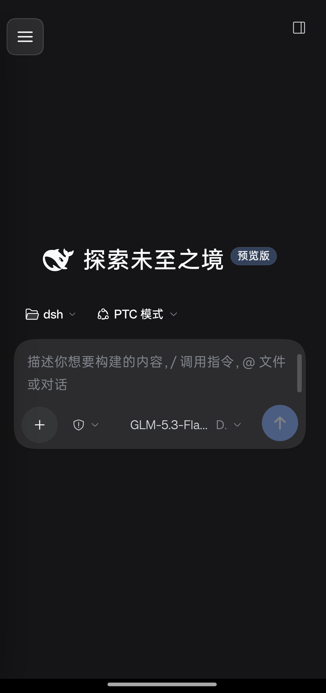
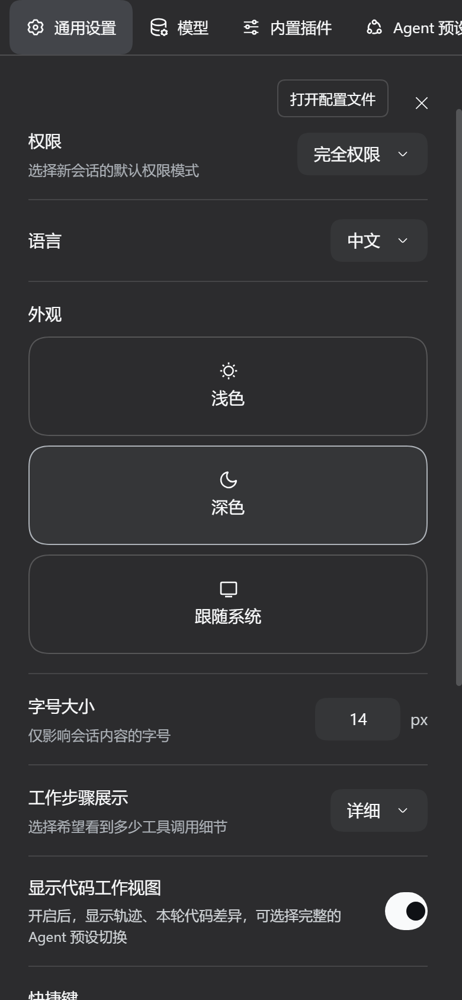

# dsh-mobile-adapt

**Give the DeepSeek Harness web GUI a real phone layout.**

[](https://www.npmjs.com/package/dsh-mobile-adapt)
[](https://www.npmjs.com/package/dsh-mobile-adapt)
[](https://github.com/clxzl/dsh-mobile-adapt/actions/workflows/ci.yml)
[](LICENSE)

English · [中文](README.md)

<p align="center">
  
  
</p>

DSH's web GUI is built for a desktop. Its stylesheets contain exactly one media
query — `prefers-reduced-motion` — and **no width breakpoints at all**. Column
widths are solved in JavaScript by AppFrame and written **inline** onto the
element. Narrow the window and the sidebar simply collapses to a 56px icon rail,
which still eats 15% of a phone screen.

This plugin adds the layout DSH never had on a phone.

## Before / after

Measured at a 390px viewport:

| | Stock DSH | With this plugin |
|---|---|---|
| Content width | **334px** — the 56px rail takes the rest | **390px**, edge to edge |
| Sidebar | icon rail only; your session list is unreachable | 86vw drawer with a scrim — button or edge swipe |
| Settings | **154px** of content, labels wrap one character per line | **390px**, a normal single column |
| Collapsed summaries | one `nowrap` line measured 1128–3949px wide, clipped to its first third | wraps; the whole preview is readable |
| Code blocks | 11px | 13px |
| Session rows | 32px | 40px |
| Viewport height | `height:100%` — the bottom sits under browser chrome | `100dvh`, and shrinks with the soft keyboard |
| Body text | 14px | 15px (16px in the composer, which also stops iOS from zooming) |

**Desktop is untouched.** Every rule is gated behind `html[data-dsh-mobile]`, and
the plugin leaves no attribute residue when it is not active.

## Install

```bash
dsh plugin --profile web add @clxzl/dsh-mobile-adapt
```

Then restart dsh:

```bash
systemctl restart deepseek-harness   # adjust to your own service
```

The package declares `dsh.bundle.patch`, so `dsh plugin add` mounts it into the
profile's bundle stack for you — no manual `cordis.patch.yml` edit.

Built and tested against **DSH 0.2.0-rc.2**. It relies only on documented DOM
anchors, so it should survive patch releases; see [Design notes](#design-notes).

<details>
<summary>Installing without npm</summary>

```bash
cd <DSH_HOME>/profiles/web/node_modules
git clone https://github.com/clxzl/dsh-mobile-adapt.git
```

Then append to `profiles/web/cordis.patch.yml` and restart dsh:

```yaml
- insert:
    - id: mobile-adapt
      name: 'dsh-mobile-adapt'
```

</details>

## What it changes

- **Layout** — three grid columns flatten to one; the center takes the viewport.
- **Sidebar** — a `position: fixed` overlay drawer (86vw, capped at 340px) with a
  scrim. Open from the top-left button or a right-swipe from the screen edge;
  dismiss with the scrim or a left swipe.
- **Viewport** — `100dvh` instead of `100%`, plus a `visualViewport` listener
  that hands the soft-keyboard inset to the app frame.
- **Text entry** — 16px in the composer, so iOS does not zoom the page on focus.
- **Readability** — 15px body; code blocks and wide tables scroll inside their
  own box; long links wrap instead of stretching the column.
- **Touch** — conversation header, composer and sidebar controls are at least
  40px; list rows are 40px; `touch-action: manipulation` drops the tap delay.
- **Safe areas** — `viewport-fit=cover` plus `safe-area-inset-*` on the drawer,
  composer and conversation header.
- **Settings dialog** — the desktop two-column dialog collapses to one column,
  with its nav rail turned into a horizontally scrolling strip.

## Design notes

Four things make this harder than a few media queries. They are also the reason
the plugin can survive DSH updates.

**1. Layout widths are not in the CSS.** AppFrame solves the columns in
JavaScript and writes `style="grid-template-columns: ..."` inline. Overriding
that takes `!important` — nothing else outranks an inline declaration.

**2. Class names are CSS-module hashes.** You will find `pI_x6G_frame` and
`wSkVaW_header` in the DOM, and they change between builds. This plugin therefore
matches **only public `data-slot` anchors** and stable attributes like
`data-composer-*` / `data-conversation-*`. Not one hashed class name is used.

**3. Slot hosts are `display: contents`.** The real grid column is the first
ancestor walking up whose computed display is *not* `contents`. And `overflow` or
`max-width` on a `contents` element do **nothing** — which is an easy way to lose
an hour to "my change had no effect".

**4. A few things have to be un-learned.** The drawer leaves the grid flow, so
auto-placement shifts the remaining columns and they have to be pinned explicitly.
And the collapsed summary rows are inline elements, where `max-width` is ignored —
they need `white-space` changed instead.

## It does not own any DSH state

The drawer keeps no open/closed flag of its own. It reads the frame's
`data-sidebar-collapsed` attribute and calls `ctx.layout.toggleSidebar()` to
change it, letting DSH own the state — so the plugin and the shell cannot
disagree.

## Development

```bash
npm run build     # src/ -> lib/
```

| Path | Role |
|---|---|
| `src/mobile.css` | all styles |
| `src/client.js` | browser-side logic; the build injects the CSS into a `__MOBILE_CSS__` placeholder |
| `lib/client.js` | the build output, **and the file DSH loads** — committed, so installing needs no build step |

The build injects the stylesheet as a JSON string literal rather than a template
literal: `JSON.stringify` escapes backticks, `${}` and quotes on its own, so the
CSS can never terminate the surrounding JavaScript by accident.

On the DSH client-plugin contract: the artifact must be a lazy-CJS bundle
(`window.__ModuleLoader__.load({ id, factory })`, exporting `apply` / `inject` on
`exports`). The host only serves it to the browser. CI asserts this shape, and
that `lib/` is in sync with `src/`, on every push.

## Limitations

- **Third-party plugin buttons are not enlarged.** dsh-better-sidebar's 28px icon
  buttons are out of scope — forcing them bigger breaks its own toolbar layout.
- **First load on a phone is still slow.** The first paint pulls several MB of
  plugin bundles; that is outside this plugin's control.
- **The right sidebar is not specially handled.** DSH's column solver already
  gives it no track on narrow screens, so it falls back to its own fullscreen
  presentation.
- **Add-to-home-screen / PWA is not included.** A manifest and iOS's
  `apple-touch-icon` have to be present in the static HTML — client-side
  injection is unreliable — so that needs a change on the server side, not a
  client plugin.

## License

[MIT](LICENSE)
